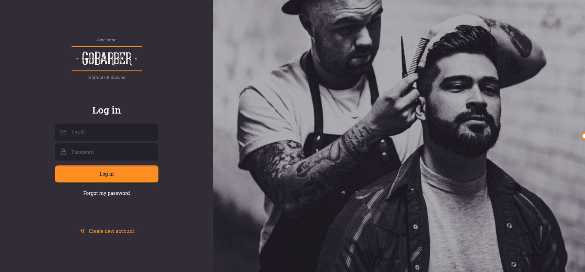

[![Contributors][contributors-shield]][contributors-url]
[![Forks][forks-shield]][forks-url]
[![Stargazers][stars-shield]][stars-url]
[![Issues][issues-shield]][issues-url]

<!-- PROJECT LOGO -->
<br />
<p align="center">
    

  <h3 align="center">GoBarber Web</h3>

  <p align="center">
    The web version of the GoBarber App.
    <br />
    <a href="https://wwww.gobarber.torres-ssf.com/">Live demo</a>
    ·
    <a href="https://github.com/Torres-ssf/gobarber-web/issues">Report Bug</a>
    ·
    <a href="https://github.com/Torres-ssf/gobarber-web/issues">Request Feature</a>
  </p>
</p>

<!-- TABLE OF CONTENTS -->

## Table of Contents

- [About the Project](#about-the-project)
  - [Live Demo](#live-demo)
  - [Built With](#built-with)
- [Getting Started](#getting-started)
  - [Prerequisites](#prerequisites)
  - [Installation](#installation)
- [Usage](#usage)
- [Contributing](#contributing)
- [License](#license)
- [Acknowledgements](#acknowledgements)

<!-- ABOUT THE PROJECT -->

## About The Project



The web version of GoBarber, an application for service providers, such as Barbers, to control customer schedules. This application consumes the [Gobarber API](https://github.com/Torres-ssf/gobarber-backend). This web version is designed to be used by providers, they can create and log into their accounts. Once logged in, they will be redirected to the dashboard, where they can find all the information related to the current day's appointments as well as for future appointments. Customers can use the mobile version of this application to create appointments with their favorite providers. This application was designed during the GoStack bootcamp.

## Live Demo

Click [here](https://wwww.gobarber.torres-ssf.com/) for a live demo of the app.

### Built With

The project was built using the following languages stacks:

```sh
Front-End(client-side)
```

- [React](https://github.com/facebook/react)
- Typescript
- [Styled-Components](https://styled-components.com/)
- [Axios](https://www.npmjs.com/package/axios)
- [Unform](https://www.npmjs.com/package/unform)
- [date-fns](https://www.npmjs.com/package/date-fns)
- [Polished](https://www.npmjs.com/package/polished)
- [React-Icons](https://react-icons.github.io/react-icons/)
- [Yup](https://www.npmjs.com/package/yup)

<!-- GETTING STARTED -->

## Getting Started

To get a local copy up and running follow these simple example steps.

### Prerequisites

- NPM

### Installation

1. Clone the repo

```sh
git clone https://github.com/Torres-ssf/gobarber-web/
```

2. CD into the project root directory

```sh
cd gobarber-web/
```

3. Install npm packages

```sh
yarn
```

4. This is the client-side of the GoBarber application. You will need to set up the server-side first before using this application. You can find GoBarber Backend [here](https://github.com/Torres-ssf/gobarber-backend).

## Usage

In the project directory, you can run:

```JS
yarn start
```
- Runs the app in the development mode.<br />

```JS
yarn build
```
- Script to deploy the app in production mode.<br />


## 🤝 Contributing

Contributions, issues and feature requests are welcome!

Feel free to check the [issues page](https://github.com/Torres-ssf/gobarber-web/issues).

## Authors

👤 **Torres-ssf**

- Github: [@Torres-ssf](https://github.com/Torres-ssf)
- Twitter: [@torres_ssf](https://twitter.com/torres_ssf)
- Linkedin: [torres-ssf](https://www.linkedin.com/in/torres-ssf/)

## Acknowledgments

- This project was created during the [GoStack Bootcamp](https://rocketseat.com.br/). I am very grateful to them for the knowledge and skills acquired here.

<!-- LICENSE -->

## 📝 License

This project is [MIT](LICENSE.md) licensed.

<!-- MARKDOWN LINKS & IMAGES -->

[contributors-shield]: https://img.shields.io/github/contributors/Torres-ssf/gobarber-backend.svg?style=flat-square
[contributors-url]: https://github.com/Torres-ssf/gobarber-web/graphs/contributors
[forks-shield]: https://img.shields.io/github/forks/Torres-ssf/gobarber-web.svg?style=flat-square
[forks-url]: https://github.com/Torres-ssf/gobarber-web/network/members
[stars-shield]: https://img.shields.io/github/stars/Torres-ssf/gobarber-web.svg?style=flat-square
[stars-url]: https://github.com/Torres-ssf/gobarber-web/stargazers
[issues-shield]: https://img.shields.io/github/issues/Torres-ssf/gobarber-web.svg?style=flat-square
[issues-url]: https://github.com/Torres-ssf/gobarber-web/issues